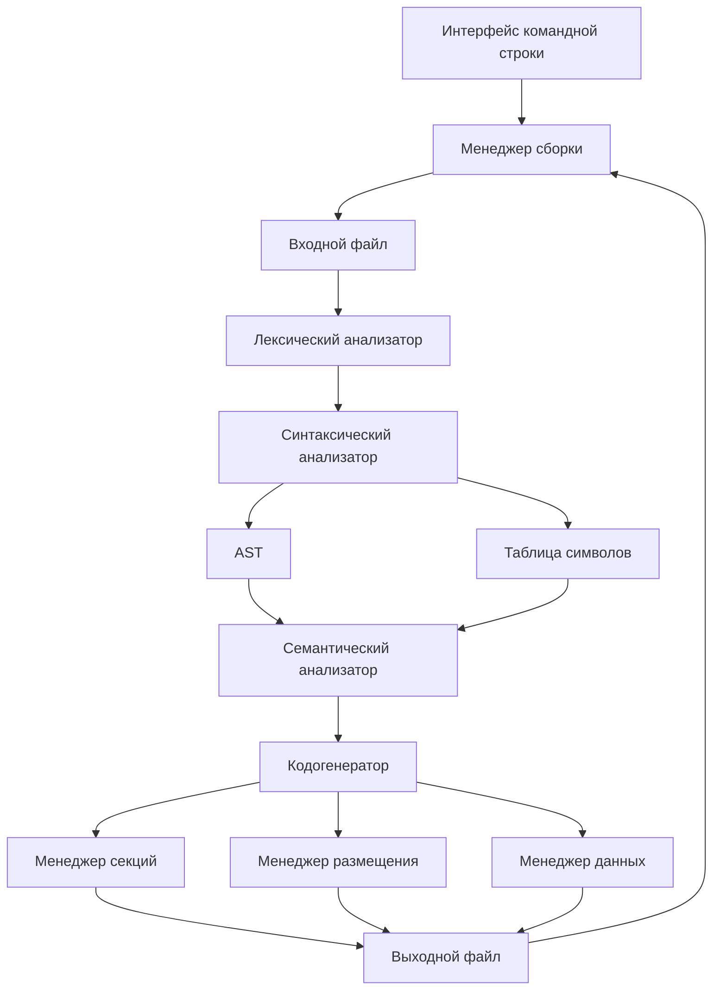

# Архитектура ассемблера ТРИАС

## Общая структура

Ассемблер ТРИАС состоит из нескольких основных компонентов, каждый из которых отвечает за свою часть процесса трансляции.

## Компоненты

### Основные компоненты трансляции

### Лексический анализатор (`lexer.h/c`)
- Разбивает входной текст на токены
- Поддерживает различные системы счисления
- Обрабатывает комментарии
- Отслеживает позиции в исходном коде

### Синтаксический анализатор (`parser.h/c`)
- Строит AST из потока токенов
- Проверяет синтаксическую корректность
- Разбирает инструкции, метки и директивы
- Обрабатывает операнды различных типов

### Абстрактное синтаксическое дерево (`ast.h/c`)
- Представляет структуру программы
- Управляет памятью узлов
- Поддерживает различные типы узлов:
  - Программа
  - Инструкции
  - Метки
  - Директивы
  - Операнды
  - Выражения
  - Макросы

### Таблица символов (`symbol_table.h/c`)
- Хранит информацию о символах
- Поддерживает области видимости
- Управляет метками и переменными
- Обрабатывает импорт/экспорт символов

### Описание инструкций (`trias_instructions.h/c`)
- Определяет набор инструкций
- Описывает форматы инструкций
- Предоставляет информацию об операндах

### Семантический анализатор (`semantic_analyzer.h/c`)
- Проверяет семантическую корректность
- Валидирует типы и значения операндов
- Проверяет корректность директив
- Анализирует зависимости между компонентами

### Кодогенератор (`code_generator.h/c`)
- Генерирует машинный код
- Размещает код и данные
- Применяет директивы
- Разрешает символьные ссылки

### Менеджер секций (`section_manager.h/c`)
- Управляет секциями кода и данных
- Отслеживает текущую секцию
- Обеспечивает переключение между секциями
- Управляет атрибутами секций

### Менеджер размещения (`layout_manager.h/c`)
- Управляет размещением в памяти
- Обрабатывает директивы размещения
- Отслеживает текущий адрес
- Обеспечивает выравнивание

### Менеджер данных (`data_manager.h/c`)
- Управляет определением данных
- Обрабатывает различные типы данных
- Конвертирует данные в троичный формат
- Размещает данные в памяти

### Компоненты тулчейна

### Менеджер сборки (`trias_builder.h/c`)
- Координирует процесс сборки
- Управляет последовательностью этапов трансляции
- Обрабатывает опции командной строки
- Управляет файлами ввода/вывода

### Интерфейс командной строки (`trias_cli.h/c`)
- Разбор аргументов командной строки
- Вывод справки и версии
- Обработка путей к файлам
- Конфигурация процесса сборки

## Процесс трансляции

1. **Лексический анализ**
   - Входной файл → Поток токенов

2. **Синтаксический анализ**
   - Поток токенов → AST
   - Построение таблицы символов

3. **Семантический анализ**
   - Проверка корректности AST
   - Валидация директив и операндов
   - Проверка зависимостей

4. **Генерация кода**
   - Размещение секций
   - Применение директив
   - Генерация машинного кода
   - Разрешение символьных ссылок

## Взаимодействие компонентов

